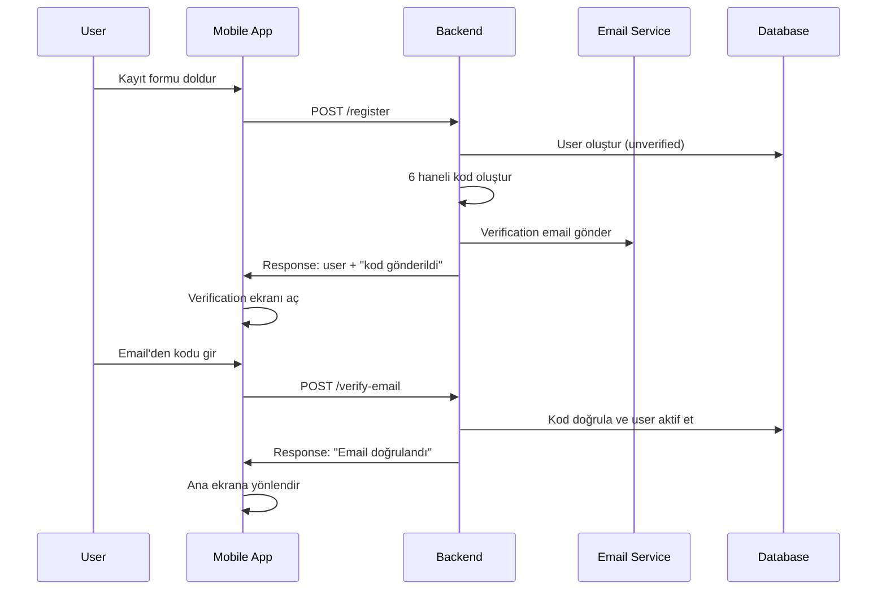

# 📧 Email Verification Sistemi İmplementasyon Rehberi

## 📋 İçindekiler
- [Sistem Genel Bakış](#sistem-genel-bakış)
- [Backend Görevleri](#backend-görevleri)
- [Mobile App Görevleri](#mobile-app-görevleri)
- [API Dokümantasyonu](#api-dokümantasyonu)
- [Güvenlik Önlemleri](#güvenlik-önlemleri)
- [Test Senaryoları](#test-senaryoları)
- [Implementasyon Adımları](#implementasyon-adımları)

---

## 🔄 Sistem Genel Bakış

### Kullanıcı Akışı


---

## 🖥️ Backend Görevleri

### 1. Database Modeli Genişletme

#### User Model Güncellemesi
```javascript
// models/user.model.js - Eklenecek alanlar

emailVerification: {
  isVerified: {
    type: Boolean,
    default: false
  },
  verificationCode: {
    type: String,
    default: null
  },
  verificationCodeExpires: {
    type: Date,
    default: null
  },
  verificationAttempts: {
    type: Number,
    default: 0
  },
  lastVerificationRequest: {
    type: Date,
    default: null
  }
}
```

### 2. Email Service Oluşturma

#### Email Configuration
```javascript
// services/email.service.js

const nodemailer = require('nodemailer');
const config = require('../configs');

const transporter = nodemailer.createTransporter({
  service: 'gmail', // veya SendGrid, Mailgun
  auth: {
    user: config.email.user,
    pass: config.email.password
  }
});

const sendVerificationEmail = async (email, code, name) => {
  const mailOptions = {
    from: config.email.from,
    to: email,
    subject: 'FinScope - Email Doğrulama Kodu',
    html: `
      <div style="font-family: Arial, sans-serif; max-width: 600px; margin: 0 auto;">
        <h2>🏦 FinScope Email Doğrulama</h2>
        <p>Merhaba ${name},</p>
        <p>Hesabınızı doğrulamak için aşağıdaki kodu kullanın:</p>
        <div style="background-color: #f0f0f0; padding: 20px; text-align: center; font-size: 24px; font-weight: bold; letter-spacing: 5px; margin: 20px 0;">
          ${code}
        </div>
        <p><strong>Bu kod 5 dakika geçerlidir.</strong></p>
        <p>Bu işlemi siz yapmadıysanız, bu email'i görmezden gelebilirsiniz.</p>
        <hr>
        <p style="color: #666; font-size: 12px;">FinScope Güvenlik Ekibi</p>
      </div>
    `
  };
  
  await transporter.sendMail(mailOptions);
};

module.exports = { sendVerificationEmail };
```

### 3. Validation Rules

#### Email Verification Validation
```javascript
// validations/emailVerification.validation.js

const Joi = require('joi');

const verifyEmailSchema = Joi.object({
  code: Joi.string()
    .length(6)
    .pattern(/^[0-9]{6}$/)
    .required()
    .messages({
      'string.length': 'Kod 6 haneli olmalıdır',
      'string.pattern.base': 'Kod sadece rakam içermelidir',
      'any.required': 'Doğrulama kodu zorunludur'
    })
});

const resendCodeSchema = Joi.object({
  email: Joi.string()
    .email()
    .required()
    .messages({
      'string.email': 'Geçerli email adresi giriniz',
      'any.required': 'Email adresi zorunludur'
    })
});

module.exports = {
  verifyEmailSchema,
  resendCodeSchema
};
```

### 4. Controller Functions

#### User Controller Güncellemesi
```javascript
// controllers/user.controller.js - Eklenecek fonksiyonlar

const { generateVerificationCode } = require('../utils/codeGenerator');
const emailService = require('../services/email.service');

// Kayıt işlemi güncelle
exports.register = async (req, res) => {
  try {
    const { name, email, password } = req.body;
    
    // Kullanıcı var mı kontrol et
    const existingUser = await User.findOne({ email });
    if (existingUser) {
      return res.status(400).json({
        success: false,
        message: 'Bu email ile kayıtlı kullanıcı zaten var'
      });
    }
    
    // Verification code oluştur
    const verificationCode = generateVerificationCode();
    const codeExpires = new Date(Date.now() + 5 * 60 * 1000); // 5 dakika
    
    // Kullanıcı oluştur (unverified)
    const user = new User({
      name,
      email,
      password,
      emailVerification: {
        isVerified: false,
        verificationCode,
        verificationCodeExpires: codeExpires,
        verificationAttempts: 0,
        lastVerificationRequest: new Date()
      }
    });
    
    await user.save();
    
    // Email gönder
    await emailService.sendVerificationEmail(email, verificationCode, name);
    
    // Token oluştur (unverified user için)
    const token = user.generateAccessToken();
    await user.save();
    
    res.status(201).json({
      success: true,
      message: 'Kayıt başarılı. Email adresinizi kontrol edin.',
      data: {
        user: {
          _id: user._id,
          name: user.name,
          email: user.email,
          isEmailVerified: user.emailVerification.isVerified
        },
        token,
        needsEmailVerification: true
      }
    });
    
  } catch (error) {
    res.status(500).json({
      success: false,
      message: error.message
    });
  }
};

// Email doğrulama
exports.verifyEmail = async (req, res) => {
  try {
    const { code } = req.body;
    const user = req.user; // Middleware'den gelir
    
    // Email zaten doğrulanmış mı?
    if (user.emailVerification.isVerified) {
      return res.status(400).json({
        success: false,
        message: 'Email adresi zaten doğrulanmış'
      });
    }
    
    // Kod doğru mu?
    if (user.emailVerification.verificationCode !== code) {
      // Yanlış deneme sayısını artır
      user.emailVerification.verificationAttempts += 1;
      await user.save();
      
      // 3 yanlış denemeden sonra kod geçersiz kıl
      if (user.emailVerification.verificationAttempts >= 3) {
        user.emailVerification.verificationCode = null;
        user.emailVerification.verificationCodeExpires = null;
        await user.save();
        
        return res.status(400).json({
          success: false,
          message: 'Çok fazla yanlış deneme. Yeni kod talep edin.'
        });
      }
      
      return res.status(400).json({
        success: false,
        message: 'Geçersiz doğrulama kodu'
      });
    }
    
    // Kod süresi dolmuş mu?
    if (user.emailVerification.verificationCodeExpires < new Date()) {
      return res.status(400).json({
        success: false,
        message: 'Doğrulama kodu süresi dolmuş. Yeni kod talep edin.'
      });
    }
    
    // Email'i doğrula
    user.emailVerification.isVerified = true;
    user.emailVerification.verificationCode = null;
    user.emailVerification.verificationCodeExpires = null;
    user.emailVerification.verificationAttempts = 0;
    
    await user.save();
    
    res.status(200).json({
      success: true,
      message: 'Email adresi başarıyla doğrulandı',
      data: {
        user: {
          _id: user._id,
          name: user.name,
          email: user.email,
          isEmailVerified: true
        }
      }
    });
    
  } catch (error) {
    res.status(500).json({
      success: false,
      message: error.message
    });
  }
};

// Kod yeniden gönder
exports.resendVerificationCode = async (req, res) => {
  try {
    const user = req.user;
    
    // Email zaten doğrulanmış mı?
    if (user.emailVerification.isVerified) {
      return res.status(400).json({
        success: false,
        message: 'Email adresi zaten doğrulanmış'
      });
    }
    
    // Rate limiting - 1 dakikada bir kod gönder
    const lastRequest = user.emailVerification.lastVerificationRequest;
    if (lastRequest && (new Date() - lastRequest) < 60000) {
      return res.status(429).json({
        success: false,
        message: 'Yeni kod için 1 dakika bekleyin'
      });
    }
    
    // Yeni kod oluştur
    const verificationCode = generateVerificationCode();
    const codeExpires = new Date(Date.now() + 5 * 60 * 1000);
    
    user.emailVerification.verificationCode = verificationCode;
    user.emailVerification.verificationCodeExpires = codeExpires;
    user.emailVerification.verificationAttempts = 0;
    user.emailVerification.lastVerificationRequest = new Date();
    
    await user.save();
    
    // Email gönder
    await emailService.sendVerificationEmail(user.email, verificationCode, user.name);
    
    res.status(200).json({
      success: true,
      message: 'Yeni doğrulama kodu gönderildi'
    });
    
  } catch (error) {
    res.status(500).json({
      success: false,
      message: error.message
    });
  }
};
```

### 5. Utility Functions

#### Code Generator
```javascript
// utils/codeGenerator.js

const generateVerificationCode = () => {
  return Math.floor(100000 + Math.random() * 900000).toString();
};

const isValidCode = (code) => {
  return /^[0-9]{6}$/.test(code);
};

module.exports = {
  generateVerificationCode,
  isValidCode
};
```

### 6. Middleware Güncellemesi

#### Auth Middleware Güncelle
```javascript
// middlewares/auth.middleware.js - Eklenecek kontrol

// Email doğrulama kontrolü ekle
const requireEmailVerification = (req, res, next) => {
  const user = req.user;
  
  // Bazı endpoint'ler email doğrulama gerektirmez
  const publicRoutes = ['/verify-email', '/resend-verification', '/profile'];
  if (publicRoutes.some(route => req.path.includes(route))) {
    return next();
  }
  
  if (!user.emailVerification.isVerified) {
    return res.status(403).json({
      success: false,
      message: 'Email adresinizi doğrulamanız gerekiyor',
      needsEmailVerification: true
    });
  }
  
  next();
};

module.exports = { requireEmailVerification };
```

### 7. Router Güncellemesi

#### User Routes
```javascript
// routers/user.router.js - Yeni route'lar ekle

const express = require('express');
const userController = require('../controllers/user.controller');
const authMiddleware = require('../middlewares/auth.middleware');
const validation = require('../validations/emailVerification.validation');

const router = express.Router();

// Mevcut route'lar...
router.post('/register', userController.register);
router.post('/login', userController.login);

// Yeni email verification route'ları
router.post('/verify-email', 
  authMiddleware, 
  validation.validateVerifyEmail, 
  userController.verifyEmail
);

router.post('/resend-verification', 
  authMiddleware, 
  userController.resendVerificationCode
);

module.exports = router;
```

---

## 📱 Mobile App Görevleri

### 1. State Management

#### User State Genişletme
```javascript
// Redux/Context - User State
const initialUserState = {
  user: null,
  token: null,
  isAuthenticated: false,
  needsEmailVerification: false,
  loading: false,
  error: null
};

// Actions
const SET_NEEDS_EMAIL_VERIFICATION = 'SET_NEEDS_EMAIL_VERIFICATION';
const EMAIL_VERIFICATION_SUCCESS = 'EMAIL_VERIFICATION_SUCCESS';
const EMAIL_VERIFICATION_ERROR = 'EMAIL_VERIFICATION_ERROR';
```

### 2. API Service

#### Email Verification Service
```javascript
// services/emailVerificationService.js

const API_BASE_URL = 'http://your-api.com/api/v1';

class EmailVerificationService {
  static async verifyEmail(code) {
    const token = await AsyncStorage.getItem('userToken');
    
    const response = await fetch(`${API_BASE_URL}/user/verify-email`, {
      method: 'POST',
      headers: {
        'Content-Type': 'application/json',
        'Authorization': `Bearer ${token}`
      },
      body: JSON.stringify({ code })
    });
    
    return response.json();
  }
  
  static async resendVerificationCode() {
    const token = await AsyncStorage.getItem('userToken');
    
    const response = await fetch(`${API_BASE_URL}/user/resend-verification`, {
      method: 'POST',
      headers: {
        'Content-Type': 'application/json',
        'Authorization': `Bearer ${token}`
      }
    });
    
    return response.json();
  }
}

export default EmailVerificationService;
```

### 3. Screens

#### Email Verification Screen
```javascript
// screens/EmailVerificationScreen.js

import React, { useState, useEffect } from 'react';
import { View, Text, TextInput, TouchableOpacity, Alert } from 'react-native';
import AsyncStorage from '@react-native-async-storage/async-storage';
import Clipboard from '@react-native-clipboard/clipboard';

const EmailVerificationScreen = ({ navigation, route }) => {
  const [code, setCode] = useState('');
  const [timeLeft, setTimeLeft] = useState(300); // 5 dakika
  const [loading, setLoading] = useState(false);
  const [canResend, setCanResend] = useState(false);
  
  const userEmail = route.params?.email;

  // Timer management
  useEffect(() => {
    const timer = setInterval(() => {
      setTimeLeft(prev => {
        if (prev <= 1) {
          setCanResend(true);
          return 0;
        }
        return prev - 1;
      });
    }, 1000);

    return () => clearInterval(timer);
  }, []);

  // Clipboard monitoring
  useEffect(() => {
    const checkClipboard = async () => {
      const clipboardContent = await Clipboard.getString();
      if (isValidCode(clipboardContent)) {
        Alert.alert(
          'Kod Algılandı',
          `Panoda kod bulundu: ${clipboardContent}\nYapıştırılsın mı?`,
          [
            { text: 'Hayır', style: 'cancel' },
            { text: 'Evet', onPress: () => setCode(clipboardContent) }
          ]
        );
      }
    };

    // App geri geldiğinde clipboard kontrol et
    const focusListener = navigation.addListener('focus', checkClipboard);
    
    return focusListener;
  }, [navigation]);

  const isValidCode = (text) => {
    return /^[0-9]{6}$/.test(text);
  };

  const handleVerifyCode = async () => {
    if (!isValidCode(code)) {
      Alert.alert('Hata', 'Lütfen 6 haneli kodu girin');
      return;
    }

    setLoading(true);
    try {
      const result = await EmailVerificationService.verifyEmail(code);
      
      if (result.success) {
        // State güncelle
        dispatch(emailVerificationSuccess());
        
        Alert.alert('Başarılı', 'Email adresiniz doğrulandı!', [
          { text: 'Tamam', onPress: () => navigation.replace('Home') }
        ]);
      } else {
        Alert.alert('Hata', result.message);
      }
    } catch (error) {
      Alert.alert('Hata', 'Bir sorun oluştu, tekrar deneyin');
    } finally {
      setLoading(false);
    }
  };

  const handleResendCode = async () => {
    setLoading(true);
    try {
      const result = await EmailVerificationService.resendVerificationCode();
      
      if (result.success) {
        setTimeLeft(300);
        setCanResend(false);
        Alert.alert('Başarılı', 'Yeni kod gönderildi');
      } else {
        Alert.alert('Hata', result.message);
      }
    } catch (error) {
      Alert.alert('Hata', 'Kod gönderilemedi');
    } finally {
      setLoading(false);
    }
  };

  const formatTime = (seconds) => {
    const mins = Math.floor(seconds / 60);
    const secs = seconds % 60;
    return `${mins}:${secs.toString().padStart(2, '0')}`;
  };

  return (
    <View style={styles.container}>
      <Text style={styles.title}>📧 Email Doğrulama</Text>
      <Text style={styles.subtitle}>
        {userEmail} adresine gönderilen 6 haneli kodu girin
      </Text>

      <TextInput
        style={styles.codeInput}
        value={code}
        onChangeText={setCode}
        placeholder="000000"
        keyboardType="numeric"
        maxLength={6}
        textAlign="center"
        fontSize={24}
      />

      <TouchableOpacity 
        style={[styles.button, !isValidCode(code) && styles.buttonDisabled]}
        onPress={handleVerifyCode}
        disabled={!isValidCode(code) || loading}
      >
        <Text style={styles.buttonText}>
          {loading ? 'Doğrulanıyor...' : 'Doğrula'}
        </Text>
      </TouchableOpacity>

      <View style={styles.timerContainer}>
        {timeLeft > 0 ? (
          <Text style={styles.timerText}>
            Yeni kod: {formatTime(timeLeft)}
          </Text>
        ) : (
          <TouchableOpacity onPress={handleResendCode} disabled={loading}>
            <Text style={styles.resendText}>Yeni kod gönder</Text>
          </TouchableOpacity>
        )}
      </View>

      <TouchableOpacity 
        style={styles.helpButton}
        onPress={() => Alert.alert('Yardım', 'Email gelmedi mi?\n\n1. Spam klasörünü kontrol edin\n2. Email adresinizi doğru yazdığınızdan emin olun\n3. Yeni kod talep edin')}
      >
        <Text style={styles.helpText}>❓ Yardım</Text>
      </TouchableOpacity>
    </View>
  );
};

const styles = StyleSheet.create({
  container: {
    flex: 1,
    padding: 20,
    justifyContent: 'center',
    backgroundColor: '#fff'
  },
  title: {
    fontSize: 24,
    fontWeight: 'bold',
    textAlign: 'center',
    marginBottom: 10
  },
  subtitle: {
    fontSize: 16,
    textAlign: 'center',
    color: '#666',
    marginBottom: 30
  },
  codeInput: {
    borderWidth: 2,
    borderColor: '#ddd',
    borderRadius: 10,
    padding: 15,
    marginBottom: 20,
    fontSize: 24,
    textAlign: 'center',
    letterSpacing: 10
  },
  button: {
    backgroundColor: '#007AFF',
    padding: 15,
    borderRadius: 10,
    marginBottom: 20
  },
  buttonDisabled: {
    backgroundColor: '#ccc'
  },
  buttonText: {
    color: 'white',
    textAlign: 'center',
    fontSize: 16,
    fontWeight: 'bold'
  },
  timerContainer: {
    alignItems: 'center',
    marginBottom: 20
  },
  timerText: {
    color: '#666',
    fontSize: 14
  },
  resendText: {
    color: '#007AFF',
    fontSize: 16,
    fontWeight: 'bold'
  },
  helpButton: {
    alignItems: 'center'
  },
  helpText: {
    color: '#007AFF',
    fontSize: 14
  }
});

export default EmailVerificationScreen;
```

### 4. Navigation Yönetimi

#### Auth Flow Güncelle
```javascript
// navigation/AuthNavigator.js

const AuthNavigator = () => {
  const { user, needsEmailVerification } = useAuth();

  if (user && needsEmailVerification) {
    return <EmailVerificationScreen />;
  }

  if (user && user.isEmailVerified) {
    return <MainAppNavigator />;
  }

  return <AuthFlowNavigator />;
};
```

### 5. Background State Management

#### App State Persistence
```javascript
// hooks/useAppState.js

import { useEffect, useState } from 'react';
import { AppState } from 'react-native';
import AsyncStorage from '@react-native-async-storage/async-storage';

const useAppState = () => {
  const [appState, setAppState] = useState(AppState.currentState);

  useEffect(() => {
    const handleAppStateChange = async (nextAppState) => {
      if (appState.match(/inactive|background/) && nextAppState === 'active') {
        // App geri geldi - persistent state restore et
        await restoreVerificationState();
      }
      
      if (nextAppState.match(/inactive|background/)) {
        // App background'a gitti - state'i kaydet
        await saveVerificationState();
      }
      
      setAppState(nextAppState);
    };

    AppState.addEventListener('change', handleAppStateChange);
    return () => AppState.removeEventListener('change', handleAppStateChange);
  }, [appState]);

  const saveVerificationState = async () => {
    const state = {
      timestamp: Date.now(),
      timeLeft: timeLeft,
      code: code
    };
    await AsyncStorage.setItem('verificationState', JSON.stringify(state));
  };

  const restoreVerificationState = async () => {
    const savedState = await AsyncStorage.getItem('verificationState');
    if (savedState) {
      const { timestamp, timeLeft: savedTimeLeft } = JSON.parse(savedState);
      const elapsed = Math.floor((Date.now() - timestamp) / 1000);
      const remainingTime = Math.max(0, savedTimeLeft - elapsed);
      
      setTimeLeft(remainingTime);
    }
  };

  return { appState };
};
```

---

## 🔗 API Dokümantasyonu

### Endpoint'ler

#### 1. POST /api/v1/user/verify-email
**Açıklama**: Email doğrulama kodu ile email adresini doğrular

**Headers**:
```
Authorization: Bearer <jwt_token>
Content-Type: application/json
```

**Request Body**:
```json
{
  "code": "123456"
}
```

**Response (Success)**:
```json
{
  "success": true,
  "message": "Email adresi başarıyla doğrulandı",
  "data": {
    "user": {
      "_id": "user_id",
      "name": "John Doe",
      "email": "john@example.com",
      "isEmailVerified": true
    }
  }
}
```

**Response (Error)**:
```json
{
  "success": false,
  "message": "Geçersiz doğrulama kodu"
}
```

#### 2. POST /api/v1/user/resend-verification
**Açıklama**: Yeni doğrulama kodu gönderir

**Headers**:
```
Authorization: Bearer <jwt_token>
Content-Type: application/json
```

**Response (Success)**:
```json
{
  "success": true,
  "message": "Yeni doğrulama kodu gönderildi"
}
```

**Response (Rate Limited)**:
```json
{
  "success": false,
  "message": "Yeni kod için 1 dakika bekleyin"
}
```

---

## 🛡️ Güvenlik Önlemleri

### Backend Güvenlik
1. **Rate Limiting**: 1 dakikada 1 kod gönderimi
2. **Deneme Sınırı**: 3 yanlış deneme sonrası kod geçersiz
3. **Zaman Aşımı**: 5 dakika kod geçerlilik süresi
4. **Code Complexity**: 6 haneli random sayı
5. **Email Sanitization**: XSS koruması
6. **JWT Validation**: Her request'te token kontrolü

### Mobile Security
1. **Secure Storage**: Token'ı güvenli yerde sakla
2. **Input Validation**: Sadece numeric input kabul et
3. **Clipboard Security**: Kullanıcı onayı ile yapıştır
4. **Screen Recording**: Sensitive screen'lerde engelle
5. **Background Protection**: Code input'u blur'la

---

## 🧪 Test Senaryoları

### Backend Test Cases
```javascript
// tests/emailVerification.test.js

describe('Email Verification', () => {
  test('Should send verification code on registration', async () => {
    // Test implementation
  });
  
  test('Should verify email with correct code', async () => {
    // Test implementation
  });
  
  test('Should reject invalid code', async () => {
    // Test implementation
  });
  
  test('Should handle expired code', async () => {
    // Test implementation
  });
  
  test('Should rate limit resend requests', async () => {
    // Test implementation
  });
});
```

### Mobile Test Cases
1. **Happy Path**: Normal doğrulama akışı
2. **Invalid Code**: Yanlış kod girme
3. **Expired Code**: Süresi dolmuş kod
4. **Network Error**: İnternet bağlantı problemi
5. **App Background**: Uygulamayı arka plana atma
6. **Clipboard**: Kod kopyalama/yapıştırma

---

## 📝 Implementasyon Adımları

### Backend İmplementasyon

#### Adım 1: Dependencies Ekle
```bash
npm install nodemailer
# veya
npm install @sendgrid/mail
```

#### Adım 2: Environment Variables
```env
# .env dosyasına ekle
EMAIL_SERVICE=gmail
EMAIL_USER=your-email@gmail.com
EMAIL_PASSWORD=your-app-password
EMAIL_FROM=FinScope <noreply@finscope.com>
```

#### Adım 3: Model Güncelle
- User model'ine emailVerification alanları ekle
- Pre-save middleware'leri güncelle

#### Adım 4: Services Oluştur
- Email service implementasyonu
- Code generator utility
- Validation schemas

#### Adım 5: Controllers & Routes
- Verification endpoint'leri ekle
- Middleware güncellemeleri
- Route definitions

#### Adım 6: Test & Deploy
- Unit testler yaz
- Integration testleri çalıştır
- Production deployment

### Mobile İmplementasyon

#### Adım 1: Dependencies Ekle
```bash
npm install @react-native-async-storage/async-storage
npm install @react-native-clipboard/clipboard
# React Native için
```

#### Adım 2: State Management
- Auth state'ine email verification ekle
- Actions ve reducers oluştur

#### Adım 3: Services
- API service methods
- AsyncStorage helpers
- Clipboard monitoring

#### Adım 4: UI Components
- Email verification screen
- Navigation updates
- Loading states

#### Adım 5: Background Handling
- App state persistence
- Timer management
- Clipboard integration

#### Adım 6: Testing
- Component testleri
- Integration testleri
- User acceptance testing

---

## 📊 Monitoring & Analytics

### Backend Metrics
- Email gönderim başarı oranı
- Doğrulama completion rate
- Failed attempt'ler
- Response time'lar

### Mobile Metrics
- Screen completion rates
- App backgrounding frequency
- Clipboard usage
- Error rates

---

## 🔧 Troubleshooting

### Yaygın Problemler

#### Backend
1. **Email gönderilmiyor**: SMTP konfigürasyonu kontrol et
2. **Token expired**: JWT secret key kontrolü
3. **Rate limiting**: Redis cache kontrol et

#### Mobile
1. **Timer durmuyor**: Background timer implementation
2. **State kaybolmasi**: AsyncStorage persistence
3. **Clipboard çalışmıyor**: Permission kontrolü

### Debug Commands
```bash
# Backend debug
npm run test:integration
npm run test:coverage

# Mobile debug
npx react-native run-android --verbose
npx react-native log-ios
```

---

## 📚 Referanslar

- [Nodemailer Documentation](https://nodemailer.com/)
- [React Native AsyncStorage](https://react-native-async-storage.github.io/async-storage/)
- [JWT Best Practices](https://tools.ietf.org/html/rfc7519)
- [OWASP Mobile Security](https://owasp.org/www-project-mobile-security-testing-guide/)

---

**💡 Bu doküman projenizin email verification sistemini baştan sona implement etmeniz için gereken tüm bilgileri içerir. Her adımı takip ederek güvenli ve kullanıcı dostu bir sistem oluşturabilirsiniz.** 